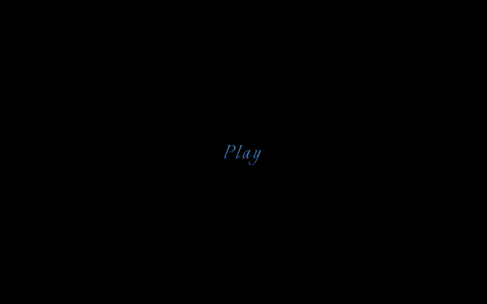

# Coding Art Project: Music & Animation in React

A creative coding project by Morgan O'Shaughnessey, combining original music with dynamic animations using React hooks. This project creates a visual complement to an audio track through rings of color that pulse and change in sync with the music.

## Description

Inspired by my visit to the Venice Biennale in August 2024, I decided to experiment with creating an audiovisual experience using React. This project synchronizes animated rings with the rhythm of an original music recording, enhancing the sensory experience by adding a visual layer to the auditory.

The music, recorded in one take, triggers three different animated "rings" that change in size, color, and position at varying intervals, creating a unique visual effect that evolves throughout the track.

## Features

- **Audio-Triggered Animation**: Rings pulse and change in color and size, timed to match the progression of the music.
- **React Hooks**: Used for managing state and creating the animated elements dynamically.
- **Responsive Design**: Works across different screen sizes and devices.
- **Custom Color Palettes**: Different rings are rendered using distinct color palettes, generating a visually rich and varied display.
- **User Interaction**: Click to play or pause the animation and music.

## Screenshots

## Technologies Used

- **Next.js**: React framework for server-side rendering and fast loading.
- **React**: The core JavaScript library used for building the user interface.
- **SCSS**: For managing complex styles and animations.
- **JavaScript (ES6+)**: Core language used for logic, including random size and color generation for the rings.
- **HTML5 Audio**: Used to handle the music playback.

## How It Works

The app leverages several key components:

- **React Hooks**: The `useState`, `useEffect`, and `useRef` hooks manage the state of the animation and synchronize it with the audio playback.
- **Dynamic Ring Generation**: Rings are randomly generated in terms of size, position, color, and border width. These are animated with custom CSS and triggered to appear and fade at set intervals.
- **Music Synchronization**: The animation timing is synchronized with the music using set timeouts and intervals to delay the appearance of additional rings and ensure they fade in and out at specific moments in the track.

## Getting Started

To get started with this project locally:

### Prerequisites

- Node.js (v20.5.0)
- yarn

### Installation

1. Clone the repository:

\`\`\`bash
git clone https://github.com/your-repo-link.git
cd your-repo-name
\`\`\`

2. Install dependencies:

\`\`\`bash
npm install
\`\`\`

3. Run the development server:

\`\`\`bash
npm run dev
\`\`\`

4. Open [http://localhost:3000](http://localhost:3000) in your browser to see the app in action.

## About the Author

Morgan O'Shaughnessey is a developer and musician with a passion for combining technology and art. This project is a reflection of their creative interests, using code to enhance auditory experiences with visual storytelling. Full portfolio available at [theMorganObject.dev](https://www.theMorganObject.dev).

## Contact Info and Links

- **Email**: [morgan.oshaughnessey@gmail.com](mailto:morgan.oshaughnessey@gmail.com)
- **Website**: [www.theMorganObject.dev](https://www.theMorganObject.dev)
- **GitHub**: [github.com/theMorganObject](https://github.com/theMorganObject)
- **LinkedIn**: [linkedin.com/in/morgan-o-shaughnessey/](https://www.linkedin.com/in/morgan-o-shaughnessey/)
- **Soundcloud**: [soundcloud](https://soundcloud.com/user-504922615)
